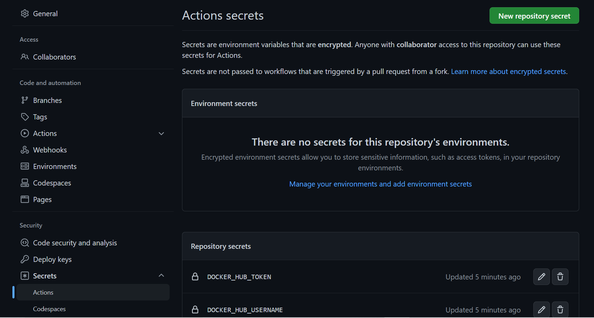
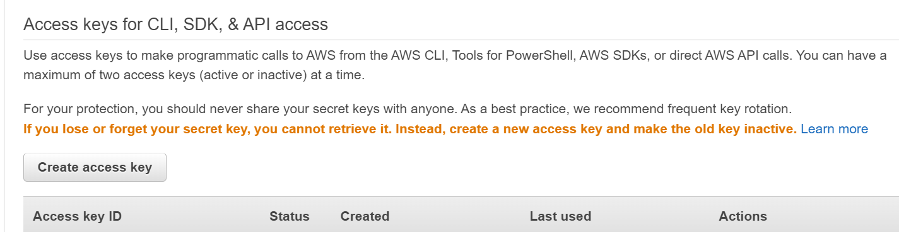

### Oppgave 1

Hva er utfordringene med dagens systemutviklingsprosess - og hvordan vil innføring av DevOps kunne være med på å løse disse? 
Hvilke DevOps prinsipper blir brutt?

Utfordringene med dagen systemutvikling på dette prosjektet er at de henger ofte etter og at prosjektet havner unødvendig mye etter, 
som igjen gjør at kunder blir misfornøyde. Dette vil ikke bare føre til misnøye hos kunder, men også hos de ansatte. Det å ofte måtte 
gå tibake til tidligere versjon....
Det å innføre DevOps vil gjøre at de kommer til å få en bedre flyt, bedre kontinuerlig leveranse og raskere kontinuerlig integrasjon. 
Disse prinsippene blir krafitg brutt her. 

En vanlig respons på mange feil under release av ny funksjonalitet er å gjøre det mindre hyppig, og samtidig forsøke 
å legge på mer kontroll og QA. Hva er problemet med dette ut ifra et DevOps perspektiv, og hva kan være en bedre tilnærming?

Ved å release ny funksjonalitet mindre hyppig 

Teamet overleverer kode til en annen avdelng som har ansvar for drift - hva er utfordringen med dette ut ifra et DevOps perspektiv, 
og hvilke gevinster kan man få ved at team han ansvar for både drift- og utvikling?

Skin the game

Å release kode ofte kan også by på utfordringer. Beskriv hvilke- og hvordan vi kan bruke DevOps prinsipper til 
å redusere eller fjerne risiko ved hyppige leveraner.

### Oppgave 3
For at ingen kan pushe kode direkte til main branch er man nødt til å sette noen 
"Branch Protection Rules". For å få til dette, går man til Branch Protection Rules som ligger
under setting og så under Branches igjen. 

Neste steg er å trykke på "Add branch protection rule". Du må så velge main som branch.
Huk også av "Require approvals" for at en må godkjenne før merging. 

Man trenger så å huke av "Require status checks to pass before merging" og så søke og velge "build".
Grunnlaget til å måtte huke av dette er fordi status sjekken "build" må passere før man kan får 
kan få merge en branch inn til main branchen. Husk at man ikke kan committe rett inn til main branchen,
 men må commit til en annen branch som så passerer, og deretter merge den inn til main branch. 

Det er aller siste man må gjøre er å krysse av "Do not allow bypassing the above settings". 

Trykk så på "Create"

### Oppgave 3.1
Workflowen feiler fordi brukernavn og passord trengs. Dette har ikke blitt lagt inn i github som
 hemmeligheter. For å fikse den feilen velger må man legge inn nye action secrets, en med brukernavn og 
en med passord.

### Oppgave 3.3
For å få lastet opp eget container image til sitt eget ECR er det noen steg som må gjennomføres.
Det første man må gjøre er å lage access keys. Gå inn på AWS og klikk på brukernavnet i høyrehjørnet, så trykk på 
"Security credentials". Sånn at du havner her:

Bla deg ned til du kommer til "Access keys for CLI, SDK, & API access", og trykk på "Create access keys".

Ta vare på disse hemmelighetene. Skriv dem ned en plass slik at du kan finne dem igjen til senere tid.

Neste steg som må gjøres er å lage action secrets. Lag to forskjellige action secrets. En AWS_ACCESS_KEY_ID der du oppgir 
nøkkelen du fikk fra AWS i stad, det samme med AWS_SECRET_ACCESS_KEY.

Det neste er å endre i docker.yml filen. Endre under docker tag og docker push der det står 1016 med ditt eget repository 
navn.

### Oppgave 5.1
Årsaken til at Terraform driver å oppretter en ny bucket når den allerede eksisterer er fordi backend 
ikke er deklarert. Hvis denne ikke blir deklarert vil terraform lage en ny state-fil, og den vil da ikke 
klare å kjøre seg igjennom uten en feilmelding. Med s3 backen deklarert vil det bli laget en kryptert 
S3 bucket for å lagre state filer. 