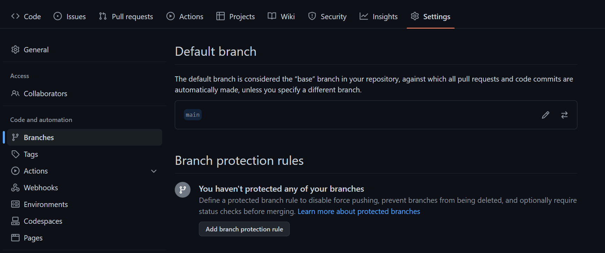

### Oppgave 3
For at ingen kan pushe kode direkte til main branch er man nødt til å sette noen 
"Branch Protection Rules". For å få til dette, går man til Branch Protection Rules som ligger
under setting og så under Branches igjen. 

Neste steg er å trykke på "Add branch protection rule". Du må så velge main som branch.
Huk også av "Require approvals" for at en må godkjenne før merging. 

Man trenger så å huke av "Require status checks to pass before merging" og så søke og velge "build".
Grunnlaget til å måtte huke av dette er fordi status sjekken "build" må passere før man kan får 
kan få merge en branch inn til main branchen. Husk at man ikke kan committe rett inn til main branchen,
 men må commit til en annen branch som så passerer, og deretter merge den inn til main branch. 

Det er aller siste man må gjøre er å krysse av "Do not allow bypassing the above settings". 

Trykk så på "Create"
