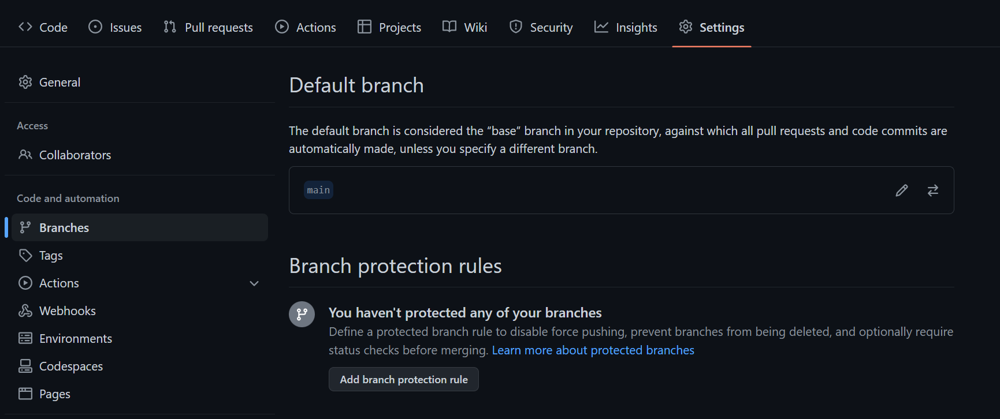
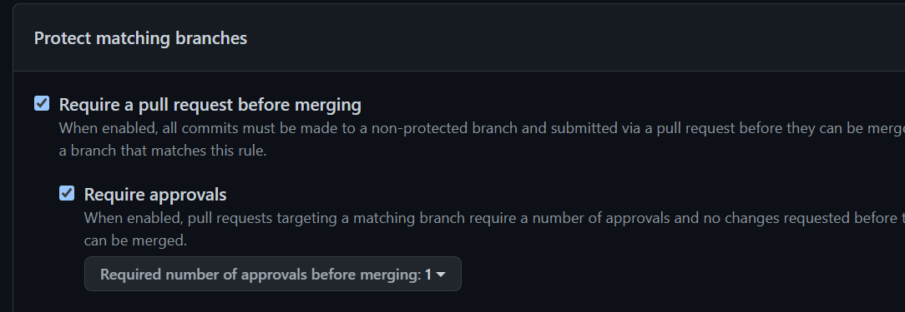
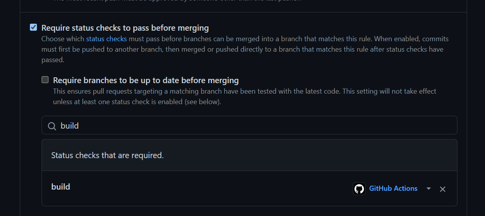
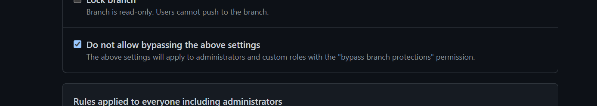
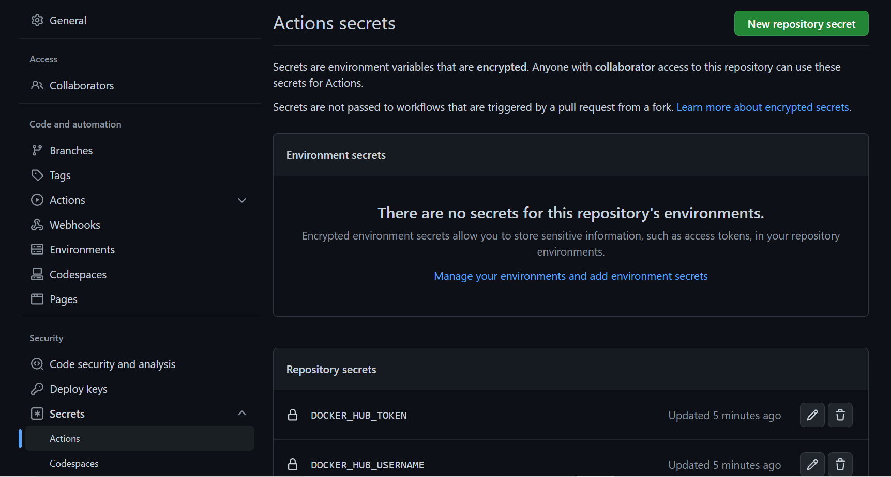
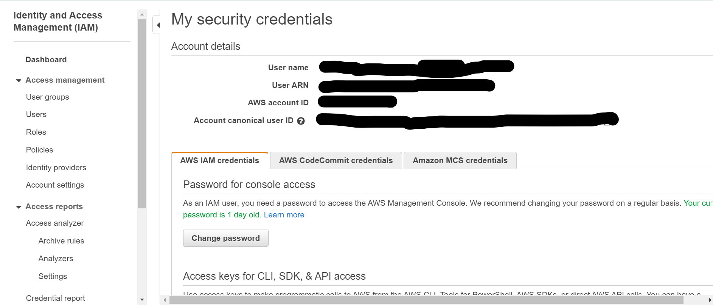
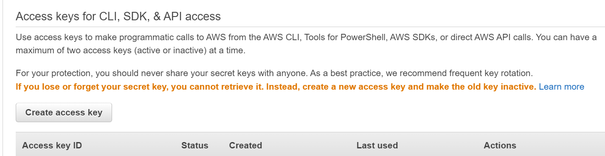
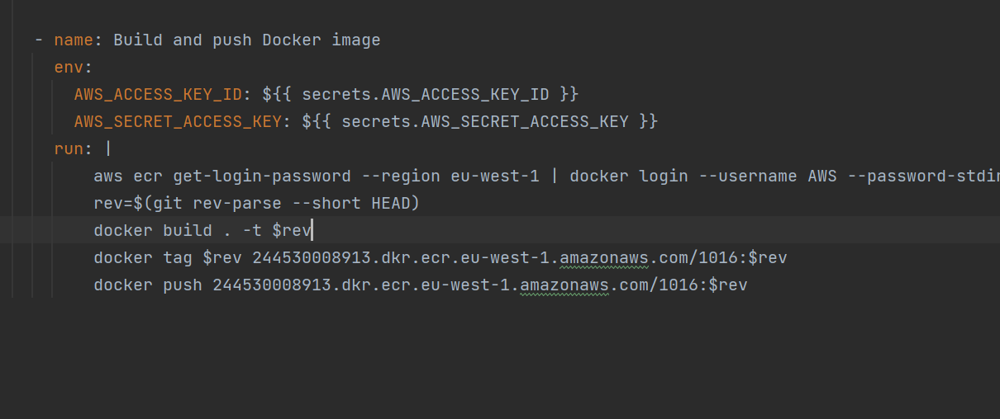

# Oppgaver

## Oppgave 1

### Hva er utfordringene med dagens systemutviklingsprosess - og hvordan vil innføring av DevOps kunne være med på å løse disse? 
Hvilke DevOps prinsipper blir brutt?

Utfordringene med dagens systemutviklingsprosess på dette prosjektet er at det ikke er en god flyt. Det å måtte gå tilbake 
til tidligere versjoner gjør både kunder og ansatte misfornøyde. Når man deployer og det alltid er feil blir det unødvendig 
mye tid til å fikse opp i dette. Det å innføre DevOps infrastrukturen vil ha en stor påvirkning på dette 
prosjektet ved at ting vil gå mer automatisk, det å deploye vil mer stabilt og slipper å feile, utviklingslederne slipper 
å alltid måtte se over alle leveranser, i tillegg vil det bli lettere å overføre filer til andre enheter.
Her er det tre viktige DevOps prinsipper som blir brutt, flyt, kontinuerlig leveranse og kontinuerlig integrasjon.

### En vanlig respons på mange feil under release av ny funksjonalitet er å gjøre det mindre hyppig, og samtidig forsøke 
å legge på mer kontroll og QA. Hva er problemet med dette ut ifra et DevOps perspektiv, og hva kan være en bedre tilnærming?

Hvis jeg forstår spørsmålet riktig, med tanke på kunnskapen jeg har fra Devops perspektiv, er at relase av 
ny funksjonalitet bør ikke skje for ofte, men ikke for sjeldent heller. Hvis release av kode skjer for ofte vil kundene 
bli irritert over hvor ofte de på oppdatere, men hvis det skjer for sjeldent vil kunden bli utålmodig. 
Det som også vil skje hvis man velger å release sjeldent er at man ikke vil lære like fort om den nye release funker eller ikke 
man kan fort ende opp at de nye funksjonalitetene ikke fungerte like bra som man hadde håpet på. Og da for å fikse feilen 
vil ta lengre tid, slik at man ender opp med å evnetuelt måtte gå tilbake til en tidligere versjon som fungerer. 
En bedre tilnærming vil være å heller deploye ofte slik at de som tester koden vil kunne kvalitetssikre den jevnt mens koden 
er i utvikling. Dette gjør at man får kvalitetssikret koden i god tid og slipper å bruke unødevenig mye tid på. Så når da en 
release vil skje er sjansen for feil mindre og kunden vil være fornøyd. "Our highest priority is to satisfy customer 
through early and continous delivery of valuable software", Agile Manifesto prinsippet.

### Teamet overleverer kode til en annen avdelng som har ansvar for drift - hva er utfordringen med dette ut ifra et DevOps perspektiv, 
og hvilke gevinster kan man få ved at team han ansvar for både drift- og utvikling?

Gevinsten man kan få ved at et team har ansvar for våde drift- og utvikling er at man kan få ett litt mer eierfølelsen til 
koden. Et team kommuniserer bedre med hverandre og har mer oversikt og kontroll over prosjektet. Hvis det er noen andre som 
har ansvar for drift og hvis feil eventuelt har oppstått vil ikke de som bare har ansvar for drift men ikke utviklingen kunne 
vite hvor feilen ligger og da fikse opp i det fort. De må da gi beskjed videre til utvilingsteamet som da må få deployet 
den forbedrede koden for å så sende dette til drifte-teamet. Her blir det unødevenig mye tid fram og tilbake og det vil da 
ta lengre tid før en forbedret kode er på plass.

### Å release kode ofte kan også by på utfordringer. Beskriv hvilke- og hvordan vi kan bruke DevOps prinsipper til 
å redusere eller fjerne risiko ved hyppige leveraner.

Det å release kode for ofte vil også føre til misnøye hos kundene. Det å måtte hente nye oppdaterinen som kanskje bare 
har en ny funksjonalitet er unødvenig. Ta dette eksempelet: Man drar ikke på butikken hver dag for å kjøpe en banan. Men 
heller planlegger i forveien slik at man slipper å dra på butikken hver eneste dag. Det er lurer å kvalitetssikre koden 
oftere og da heller ikke release kode så ofte som man har gjort tidligrere.

## Oppgave 2.3
For at ingen kan pushe kode direkte til main branch er man nødt til å sette noen 
"Branch Protection Rules". For å få til dette, går man til Branch Protection Rules som ligger
under setting og så under Branches igjen. 

Neste steg er å trykke på "Add branch protection rule". Du må så velge main som branch.
Huk også av "Require approvals" for at en må godkjenne før merging. 

Man trenger så å huke av "Require status checks to pass before merging" og så søke og velge "build".
Grunnlaget til å måtte huke av dette er fordi status sjekken "build" må passere før man kan får 
kan få merge en branch inn til main branchen. Husk at man ikke kan committe rett inn til main branchen,
 men må commit til en annen branch som så passerer, og deretter merge den inn til main branch. 

Det er aller siste man må gjøre er å krysse av "Do not allow bypassing the above settings". 

Trykk så på "Create"

## Oppgave 3.1
Workflowen feiler fordi brukernavn og passord trengs. Dette har ikke blitt lagt inn i github som
 hemmeligheter. For å fikse den feilen velger må man legge inn nye action secrets, en med brukernavn og 
en med passord.

## Oppgave 3.3
For å få lastet opp eget container image til sitt eget ECR er det noen steg som må gjennomføres.
Det første man må gjøre er å lage access keys. Gå inn på AWS og klikk på brukernavnet i høyrehjørnet, så trykk på 
"Security credentials". Sånn at du havner her:

Bla deg ned til du kommer til "Access keys for CLI, SDK, & API access", og trykk på "Create access keys".

Ta vare på disse hemmelighetene. Skriv dem ned en plass slik at du kan finne dem igjen til senere tid.

Neste steg som må gjøres er å lage action secrets. Lag to forskjellige action secrets. En AWS_ACCESS_KEY_ID der du oppgir 
nøkkelen du fikk fra AWS i stad, det samme med AWS_SECRET_ACCESS_KEY.

Det neste er å endre i docker.yml filen. Endre under docker tag og docker push der det står 1016 med ditt eget repository 
navn.

## Oppgave 5.1
Årsaken til at Terraform driver å oppretter en ny bucket når den allerede eksisterer er fordi backend 
ikke er deklarert. Hvis denne ikke blir deklarert vil terraform lage en ny state-fil, og den vil da ikke 
klare å kjøre seg igjennom uten en feilmelding. Med s3 backen deklarert vil det bli laget en kryptert 
S3 bucket for å lagre state filer. 